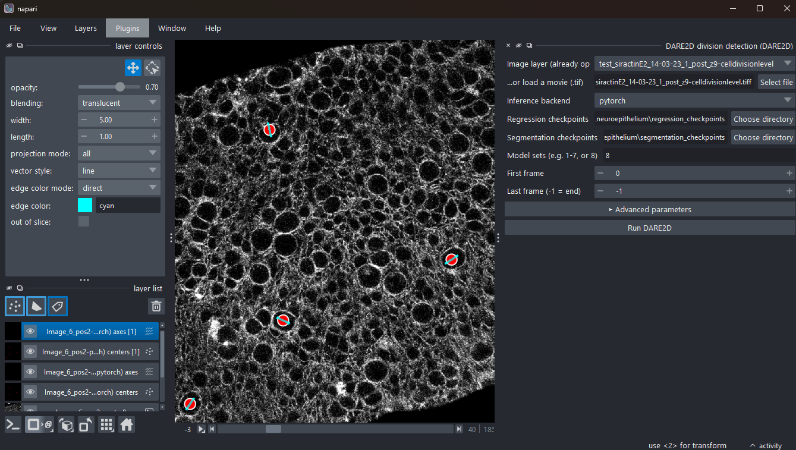

<div align="center">

# DARE2D — Division Axis and Region Estimation in 2D time-lapse images

<a href="https://www.tensorflow.org/"></a>
<a href="https://keras.io/"></a>
<a href="https://pytorch.org/"></a>
<a href="https://hydra.cc/"></a>
<a href="https://napari.org"></a>

</div>

---

**DARE2D** detects cell divisions in 2D time-lapse microscopy and estimates each division's
**center**, **orientation**, and **axis length**, in two stages:

1. **Segmentation (center detection)** — a U-Net that localises division centers.
2. **Regression** — estimates the division-axis orientation and length.

Robust detection uses an **8-model ensemble + consensus**. This repository contains both our initial TensorFlow/Keras framework as well as an updated,
faster **PyTorch** version, together with a **napari plugin** (`napari_dare2d`) that runs it
interactively.

<div align="center">



</div>

> **Version 2.** This is **DARE2D v2**, building on the original
> [v1 release](https://github.com/JFRupprecht-OM/DARE2d) (TensorFlow/Keras only). The two
> headline additions in v2 are **(1) a PyTorch (GPU) backend** (`dare2d-torch/`) for inference
> *and* leave-one-out training — same detections as Keras (parity ~1e-7) — and **(2) a napari
> plugin** (`napari_dare2d/`) with widgets for interactive division detection, ground-truth
> annotation viewing, and retraining.
>
> **Beta in this version:** the **retraining** and **fine-tuning / transfer-learning** workflows
> (CLI, notebook, and the napari widget) are included as **experimental** — they run end to end, but
> their results and parameters/API may change in a future version. Inference is the stable path.

> **Citation.** If you use DARE2D, please cite the preprint:
> Karpinski R., Gros A., Karnat M., Saaheelur Rahaman Q., Vanaret J., Saadaoui M., Tlili S. L.,
> Rupprecht J.-F. (2026). *DARE: Division Axis and Region Estimation from 2D and 3D Time-Lapse
> Images.* bioRxiv. https://doi.org/10.1101/2024.02.05.578987


### Inference backends (CPU & GPU)

Inference runs with either of two interchangeable backends, chosen in the napari widget's
**Inference backend** dropdown:

| Backend | Framework | Notes |
|---|---|---|
| **`keras`** (default) | TensorFlow / Keras | The original models; the only path on native-Windows TF (TF ≥2.11 has no Windows GPU support). |
| **`pytorch`** | faithful PyTorch port (`dare2d-torch/`) | Produces the **same detections** as Keras — verified on set 8 (0 px centre shift, Δangle = Δlength = 0; parity ~1e-7). Loads `.pt` weights generated once via `dare2d-torch/convert_to_torch.py`. |

## Repository contents

```
dare2d/                       # core TF/Keras package (pip install -e .)
├── datamodule/               #   data loading, generators, augmentation
├── model/                    #   network architectures (U-Net seg + regression head)
├── losses/   evaluation/     #   loss functions; centre / angle / length metrics
├── prediction/ callbacks/    #   inference utilities; training callbacks
├── trainer/                  #   training-loop utilities
└── io.py     typing.py       #   I/O helpers; type definitions
config/                       # Hydra config tree (train.yaml + model/ datamodule/ experiment/ batch_training/ trainer/ …)
scripts/                      # CLIs: all_model_inference.py, inference/, postprocessing/, batch_train/ (leave-one-out), train/, tools/
annotator/                    # preprocessing (format_gastru) + annotation utilities
napari-dare2d/                # the napari plugin (in-process inference + retraining widgets)
dare2d-torch/                 # PyTorch GPU port of both models (inference) + ONNX export
training/                     # leave-one-out retraining: tf/ (CPU + WSL-GPU) + torch/ (GPU) + shared prepare.py
models/                       # checkpoints (git-ignored): demo/<dataset>/ = curated 8-set ensembles; <run>/ = retraining outputs
data/                         # datasets (git-ignored): demo/<dataset>/ raw sets + prepared/ generator cache
input/  output/               # CLI inference inputs (you populate) / outputs (git-ignored)
notebooks/                    # Run_dare2d_Prediction (inference), Run_dare2d_Retraining (retraining),
                              #   Division_detection, data_analysis, train_data_display
```

> **`dare2d/` vs `dare2d-torch/`.** `dare2d/` is the importable, `pip install -e .` **package**
> (the TF/Keras backend — used as `import dare2d…` and in the Hydra configs), so it keeps the bare
> name. `dare2d-torch/` is the self-contained **PyTorch** backend (models + inference + ONNX),
> imported by module name off `sys.path` — an equal-status backend, just structured as a plain
> folder rather than an installed package.

> **Folder-level docs.** [`dare2d/README.md`](dare2d/README.md) explains the core-package internals;
> [`napari-dare2d/README.md`](napari-dare2d/README.md) explains the plugin internals.

## Installation

DARE2D has **two interchangeable backends** — TensorFlow/Keras and PyTorch — installed the same
way: a shared stack (**`requirements-common.txt`**) plus one or both of **`requirements-tf.txt`**
/ **`requirements-torch.txt`** (each pulls in the shared stack via `-r`). The one hard constraint
is **numpy `<1.24`** (pinned to `1.23.5`): TensorFlow 2.12 requires it and Torch 2.6 is compatible
with it, so the pin holds for both. Use a fresh conda env so nothing is re-resolved against newer
numpy.

```bash
git clone https://github.com/qazi05/DARE2d
cd DARE2d

# 1) conda environment
conda create -n dare2d-napari python=3.10 -y
conda activate dare2d-napari

# 2) backend dependencies — each file includes the shared stack (requirements-common.txt).
#    The napari plugin offers both backends in one dropdown, so for the full plugin install both:
pip install -r requirements-tf.txt        # TensorFlow / Keras backend (CPU)
pip install -r requirements-torch.txt     # PyTorch backend (GPU / CUDA)

# 3) napari + its Qt backend — installed explicitly: pinning napari[all] in the requirements
#    does not reliably pull a Qt backend on a fresh resolve.
pip install "napari[all]"

# 4) the DARE2D core, then the plugin (no deps -> don't disturb the pins)
pip install -e .
pip install --no-build-isolation --no-deps -e ./napari-dare2d
```

> On a corporate network you may need `--trusted-host pypi.org --trusted-host files.pythonhosted.org`.
>
> **The two backends are peers.** `requirements-tf.txt` and `requirements-torch.txt` each install
> the shared `requirements-common.txt` plus their framework; the napari widget's **Inference
> backend** dropdown switches between `keras` (TF, CPU) and `pytorch` (GPU) — same detections,
> parity ~1e-7. The PyTorch `.pt` weights ship with the Zenodo data (unzipped next to each
> `best.h5`; see **Models & data**), so the `pytorch` backend uses the same checkpoint fields as
> `keras` — a retrained run dir works the same way, no rename. For a non-CUDA-12.4 machine, swap
> `cu124` for your toolkit in `requirements-torch.txt`. (Native-Windows TF is CPU-only; GPU TF
> training needs WSL2 — see the note under **Retraining**.)

## Models & data

Published on **Zenodo** ([record 17442227](https://zenodo.org/records/17442227)):
`regression_checkpoints.zip`, `segmentation_checkpoints.zip`, `neuroepithelium.zip`, and
`torch_weights.zip` (pre-converted `best.pt` for the GPU/`pytorch` backend, unzipped next to
each `best.h5`). Demo datasets are grouped under a `demo/` namespace (neuroepithelium is the first;
others can be added alongside it). The napari plugin reads checkpoints from
`models/demo/neuroepithelium/` and the dataset from `data/demo/neuroepithelium/` (kept local, not in git):

```
models/demo/neuroepithelium/regression_checkpoints/checkpoints_set_{1..8}_all_but_target/best.h5   (+ best.pt)
models/demo/neuroepithelium/segmentation_checkpoints/checkpoints_set_{1..8}_all_but_target/best.h5   (+ best.pt)
data/demo/neuroepithelium/set_{1..8}/     # movie .tiff + division_position*.npy
```

The easiest route is to click **DARE2D download data** in the plugin (Plugins → DARE2D), which
fetches all of the above and places it in exactly this layout. (The command-line ensemble in
`scripts/all_model_inference.py` instead reads `regression_checkpoints/` /
`segmentation_checkpoints/` under its `BASE_DIR`; unzip a copy there for CLI use.)

## Data format

**Input.** 8-bit grayscale `.tif`/`.tiff` stacks shaped `(T, Y, X)` (time, height, width). The
in-process API and napari plugin require **8-bit** (they histogram-equalise each frame); the
command-line ensemble reads `.tif` stacks placed in `input/`.

**Ground truth / annotations.** Per-frame `division_position{n}.npy` arrays whose rows are
`[row, col, frame]`, with consecutive rows the two daughter cells of one division (`frame` is
1-based). These ship in each `data/.../set_N/` and are what retraining and the **Load annotations**
widget read.

**Output.** Detections are written as:
- **napari plugin** (*DARE2D save results*) → one run folder (default `output/dare2d_<date>/`):
  per-frame `division_position*.npy` (`[x, y]` pairs), a `*_summary.csv` (frame, x, y, angle,
  length, …) and an overlay `*_result.tiff` movie.
- **CLI ensemble** (`scripts/all_model_inference.py`) → `output/{image}_{set}/…` per model set;
  `scripts/postprocessing/main.py` then aggregates them into consensus detections under your
  chosen `--save_dir` (a `*_summary.csv`, the consensus `.npy`s and a rendered `.tiff`).

## Inference

Inference can be run **three ways** — pick whichever fits your workflow:

**1. Terminal (CLI).** Batch every `.tif` in `input/` through the 8-model ensemble:
```bash
python scripts/all_model_inference.py
# or one image with a single model set:
python -m scripts.inference.multistage_detection2d --regression ... --segmentation ... --img ... --output ...
```

**2. Notebook.** Open `notebooks/Run_dare2d_Prediction.ipynb` — discovers `.tif` inputs, runs the ensemble,
generates consensus detections, and plots them.

**3. napari plugin.** Launch `napari`, then **Plugins → DARE2D division detection**. Load a `.tif`
stack, choose the **Inference backend** (`keras`/CPU or `pytorch`/GPU); the **Regression /
Segmentation checkpoint** fields default to `models/demo/neuroepithelium/…` (or point them at a retrained run dir),
set the model sets / frame range, and **Run** — results appear as a Points layer (centers) and a
Vectors layer (axes). Then **DARE2D save results** exports them to disk — per-frame
`division_position*.npy`, a `*_summary.csv`, and an overlay `*_result.tiff` movie.

## Postprocessing & consensus

A single model set gives raw per-frame detections; **N-model ensemble** (typically N = 8) is made robust by a
consensus step — run automatically by the notebook and the napari plugin, and available as a
standalone CLI:

1. **Spatial clustering** — detections are grouped by proximity with HDBSCAN (DBSCAN fallback if
   `hdbscan` isn't installed), the radius scaled to cell size, so detections of the same cell merge.
2. **Temporal de-duplication** — within a cluster, repeats across neighbouring frames are collapsed
   so a cell isn't counted several times.
3. **Consensus** — median position, angle and axis length per cluster, plus uncertainty
   (`angle_std_deg`, `length_std`, `pos_std`) and the number of agreeing models.

**Parameters** (same names in the API, notebook and CLI):

| Parameter | Meaning | Default |
|---|---|---|
| `eps` | spatial clustering radius (px), ≈ cell size | `10` |
| `min_models` | models that must agree to keep a cluster | `6` |
| `num_models` | models in the ensemble | `8` |
| `angle_mode` | angle-unit handling (`auto` / `degrees` / `radians`) | `auto` |

**Standalone CLI** (the notebook/plugin do this for you):
```bash
python scripts/postprocessing/main.py \
  --output_root output --image_name my_movie.tif \
  --image_stack input/my_movie.tif --save_dir output/my_movie_consensus \
  --eps 10 --min_models 6 --num_models 8
```

## Retraining (leave-one-out)

> ⚠️ **Beta — experimental.** Retraining and fine-tuning (transfer learning) are new and still
> experimental. They run end to end, but results and the widget/CLI parameters may change between
> versions, so treat retrained or fine-tuned checkpoints and their settings as provisional. The
> inference pipeline is the stable path.

Train on a subset of sets and test on the complement, producing
`checkpoints_set_{n}_all_but_target/best.h5` — the exact layout inference consumes. Retraining can
be run **three ways**:

**1. Terminal (CLI).** Run the leave-one-out driver for each stage:
```bash
python -m scripts.batch_train.batch_train_eval experiment=regression2d batch_training=regression2d
python -m scripts.batch_train.batch_train_eval experiment=segmentation2d batch_training=center_detection2d
```

**2. Notebook.** Open `notebooks/Run_dare2d_Retraining.ipynb` — it preprocesses each raw set into the
per-frame layout the generators read, then runs the same leave-one-out training for both stages.

**3. napari plugin.** Launch `napari`, then **Plugins → DARE2D retraining & fine-tuning (beta)**. Pick the **Test set**
(held out), optional **Train sets** (blank = the rest), **Model** (both / regression / segmentation)
and **Backend** (PyTorch GPU, TensorFlow CPU, or TensorFlow WSL GPU), then **Start retraining** — a
progress bar tracks the epochs and an inline **Stop retraining** button cancels it. Output lands in
`models/<run>/…` (dated; the curated `models/demo/<dataset>/` is never overwritten). If the dataset isn't present yet, a
**Download data** button appears in the widget first.

The backends live in `training/` (native-Windows TF is CPU-only): `tf/` (a WSL2 TF-GPU path +
native-Windows CPU `train_split.py`) and `torch/` (native-Windows GPU `train.py`), wrapped by both
the notebook and the napari widget above.

> **Windows / WSL note.** Native-Windows TensorFlow 2.12 is **CPU-only** (TF ≥2.11 has no
> Windows GPU support), so on Windows **TF retraining runs on CPU**. Training TensorFlow **on
> the GPU** is only possible through the **TensorFlow (WSL GPU)** backend, which **requires
> WSL2** (with a CUDA-enabled `dare2d-train` env inside it) — without WSL2 that option will not
> work. For native-Windows **GPU** training use the **PyTorch (GPU)** backend instead; the
> **TensorFlow (CPU)** backend also needs no WSL. (Inference never needs WSL: `keras` runs on
> CPU and `pytorch` on GPU.)

## Checks

```bash
python napari-dare2d/verify_layers.py   # fast: geometry + napari mapping (no models)
python napari-dare2d/verify_api.py      # real: builds set-8 models, runs inference (needs checkpoints)
```

## Troubleshooting

**Missing checkpoints / "checkpoint missing" errors.** Ensure all 8 sets are present with a
`best.h5` (and `best.pt` for the `pytorch` backend) under the folders the tool expects: the napari
plugin defaults to `models/demo/neuroepithelium/{regression,segmentation}_checkpoints/` (the **Download data**
button fills these), while `scripts/all_model_inference.py` reads `regression_checkpoints/` /
`segmentation_checkpoints/` under its `BASE_DIR` — set that to your project root.

**Import errors / `ModuleNotFoundError`.** Activate the env (`conda activate dare2d-napari`) and
install both requirement files (`pip install -r requirements-tf.txt -r requirements-torch.txt`)
plus the editable packages (`pip install -e .` and the plugin). There is no bare `requirements.txt`.

**napari opens but the DARE2D widgets aren't listed / no Qt backend.** Install napari with a Qt
backend explicitly (`pip install "napari[all]"`), then reinstall the plugin with
`--no-deps --no-build-isolation` so the numpy pin isn't disturbed.

**napari closes/crashes spuriously (often after a flood of `Unable to open monitor interface to
\\.\DISPLAY1: ... 0xe0000225` warnings).** This is a Windows display / OpenGL-context problem, not a
DARE2D error: Qt cannot find the physical monitor (`0xE0000225` = `SPAPI_E_NO_SUCH_DEVINST`), which
is typical of Remote Desktop, virtual displays, or a monitor that sleeps/disconnects — and napari's
vispy OpenGL canvas dies when the GL context is lost, taking the window down with no Python
traceback. Force software rendering before launching napari: set `QT_OPENGL=software` and
`LIBGL_ALWAYS_SOFTWARE=1` (or persist them in the env with
`conda env config vars set QT_OPENGL=software`). Running on the physical console instead of RDP,
updating the GPU driver, and disabling monitor sleep during use also remove the trigger.

**`pytorch` backend unavailable.** Torch isn't installed, or its CUDA build doesn't match your
toolkit — install `requirements-torch.txt` (swap `cu124` for your CUDA version). The `.pt` weights
must sit next to each `best.h5`; the Download button ships them.

**Out-of-memory.** Lower the frame range, `crop` or `batch-size` (retraining), process fewer frames,
or use the `keras`/CPU backend for very large images.

**TF retraining won't use the GPU on Windows.** Expected — native-Windows TF 2.12 is CPU-only. Use
the **PyTorch (GPU)** backend, or the **TensorFlow (WSL GPU)** backend under WSL2 (see the Windows /
WSL note above).

## Related projects

- **DARE3D** — the 3D (volumetric) version of this framework:
  [github.com/JFRupprecht-OM/DARE3d](https://github.com/JFRupprecht-OM/DARE3d)

## License & attribution

MIT — see [LICENSE](LICENSE). This work was granted access to the HPC resources of IDRIS under the
allocation AD010314339 made by GENCI.
